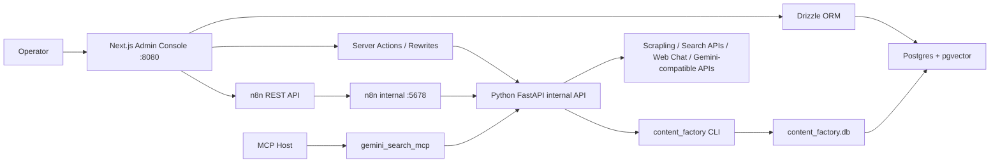

# ContentPilot 框架设计文档

## 1. 项目核心

ContentPilot 的核心是面向网站资源采集、治理和内容发布流程控制的 SaaS 后台系统。

当前项目不应再以“搜索 API”“MCP 服务”或“n8n 模板库”作为主线理解。它们都是支撑能力。主线应是：

- 配置采集哪些网站资源。
- 管理网站资源元数据、sitemap、URL 队列、页面内容、摘要、向量和质量状态。
- 查看采集进度、采集结果、失败原因、清洗状态和发布状态。
- 从后台启动采集、处理、清洗、内容生产、审核、发布和指标回流流程。
- 以 Postgres + pgvector 作为资源数据库和后续检索/应用的底座。

因此架构分层应按下面方式理解：

| 层级 | 定位 | 当前实现 |
| --- | --- | --- |
| 后台入口 | 用户主控制台 | `apps/web` Next.js App Router |
| 数据核心 | 资源库、内容库、模板库、向量库 | Postgres + pgvector + Drizzle |
| 执行层 | 抓取、清洗、摘要、embedding、发布任务 | Python FastAPI + `content_factory` CLI |
| 编排层 | 工作流编辑、调度和自动化执行 | n8n |
| 兼容接入 | OpenAI-compatible API、MCP、旧 API | FastAPI、`gemini_search_mcp` |

## 2. 当前源码现状

本次检查后的关键事实：

- 后台已经切到 Next.js：`apps/web`。
- Next.js 直接通过 Drizzle 连接 Postgres/pgvector：`apps/web/lib/db/*`。
- 后台页面已经包含 Dashboard、Sites、URL Queue、Pages、Pipeline、Templates、Settings。
- Python API 仍是 FastAPI：`gemini_search/server.py`。
- Python API 当前职责是内部执行 API、抓取 API、运行时配置、OpenAI-compatible API 和旧静态控制台。
- `n8n-mcp` 已不再出现在当前 `package.json` 集成和 `docker-compose*.yml` 运行服务中。
- n8n workflow 模板现在通过导入脚本进入 Postgres：`scripts/import_n8n_workflow_templates_to_postgres.py`。
- `vendor/n8n-workflows` 当前在工作区中表现为大量删除，说明模板库不应再被视为稳定的运行时依赖目录。
- 当前仍存在 SQLite 迁移遗留：`sql/content_factory_schema.sql` 仅保留为 legacy 参考/迁移来源；`content_factory/db.py` 默认已改为直连 Postgres。

## 3. 总体架构



默认对用户暴露的入口：

```text
8080  ContentPilot Next.js 后台
```

Docker 内部服务：

```text
contentpilot:8080      Python FastAPI / task executor
contentpilot-web:8080  Next.js admin console
n8n:5678               workflow builder and scheduler
```

本地非 Docker 调试建议：

```text
8080  Next.js 后台
8081  Python FastAPI API
5678  n8n，仅需要直接编辑工作流时启动
```

当前端口策略已经比之前更清晰：用户入口压到一个端口，FastAPI 和 n8n 默认在容器网络内部。

## 4. Next.js 后台

当前后台目录：`apps/web`。

| 页面 | 路径 | 当前能力 |
| --- | --- | --- |
| Dashboard | `/` | 展示站点、队列、页面、embedding、向量、topic、content、publication 指标；支持快速启动 crawl-run。 |
| Sites | `/sites` | 展示网站资源、base URL、状态、最近 discover/crawl 时间；支持 Discover、Process 操作。 |
| URL Queue | `/queue` | 展示最近发现 URL、来源、优先级、状态和尝试次数。 |
| Pages | `/pages` | 展示已采集页面、HTTP 状态、质量分、摘要模型和抓取时间。 |
| Pipeline | `/pipeline` | 展示内容生产流水线中的关键词、标题、渠道和状态。 |
| Templates | `/templates` | 搜索 n8n workflow 模板，按分类浏览，支持导出 JSON 和部署到 n8n。 |
| Settings | `/settings` | 展示当前数据库、数据库用户和 n8n API URL。 |

后台数据读取链路：

```text
Next.js Server Component
  -> apps/web/lib/data.ts
  -> Drizzle
  -> Postgres/pgvector
```

后台任务触发链路：

```text
Next.js Server Action
  -> apps/web/lib/actions.ts
  -> CONTENTPILOT_API_URL /api/content-factory/task
  -> FastAPI
  -> content_factory CLI
```

Next.js rewrite 当前代理：

```text
/v1/*
/api/health
/api/runtime/*
/api/test
/api/scrape
/api/content-factory/*
```

这意味着外部调用方可以只访问 Next.js 入口，不需要直接暴露 Python API。

## 5. 数据模型

Drizzle schema 当前位于 `apps/web/lib/db/schema.ts`，应作为新的主 schema 候选。

### 5.1 采集资源表

| 表 | 作用 |
| --- | --- |
| `crawl_sites` | 网站资源配置、base URL、domain、允许域名、采集策略、状态。 |
| `crawl_runs` | discover/process 的运行记录和计数。 |
| `crawl_sitemaps` | sitemap URL、类型、状态、URL 数量和错误。 |
| `crawl_urls` | URL 队列、优先级、来源、状态、重试和错误信息。 |
| `crawl_pages` | 页面 HTML、Markdown、标题、描述、摘要、质量分和处理状态。 |
| `crawl_page_embeddings` | 页面向量，使用 pgvector `vector` 类型，并声明 HNSW cosine 索引。 |

### 5.2 内容生产表

| 表 | 作用 |
| --- | --- |
| `topic_pool` | 选题池、意图、优先级、负责人和状态。 |
| `research_assets` | 研究素材、来源、摘要、原文和可靠性。 |
| `content_items` | 内容大纲、草稿、终稿、SEO 信息和状态。 |
| `publication_records` | 发布渠道、状态、URL、响应和发布时间。 |

### 5.3 n8n 模板表

| 表 | 作用 |
| --- | --- |
| `n8n_workflow_templates` | 保存从 Zie619/n8n-workflows 导入的模板 JSON、分类、节点类型、触发器、搜索文本和 hash。 |

模板使用链路：

```text
vendor/n8n-workflows/workflows
  -> scripts/import_n8n_workflow_templates_to_postgres.py
  -> n8n_workflow_templates
  -> /templates 搜索、导出、部署
```

注意：当前 `vendor/n8n-workflows` 在工作区中已大量删除。如果以后继续依赖模板导入，需要明确模板来源是临时同步目录、独立下载缓存，还是数据库中已导入的数据。

### 5.4 设置表

| 表 | 作用 |
| --- | --- |
| `app_settings` | 保存应用配置项、分类、标签、描述和 secret 标记。当前 UI 尚未形成完整配置编辑页。 |

## 6. 执行层

FastAPI 文件：`gemini_search/server.py`。

当前 FastAPI 暴露：

- `/api/health`
- `/api/runtime`
- `/api/runtime/restart`
- `/api/test`
- `/api/scrape`
- `/api/content-factory/overview`
- `/api/content-factory/task`
- `/v1/models`
- `/v1/chat/completions`
- `/`

核心作用：

- 给 Next.js 后台提供内部任务触发接口。
- 执行抓取、清洗、摘要、embedding 和发布任务。
- 保留 OpenAI-compatible API，方便上层应用接入。
- 保留 MCP 能力的底层支撑。

Python CLI 文件：`content_factory/cli.py`。

当前任务能力包括：

- `crawl-discover`
- `crawl-process`
- `crawl-run`
- `discover`
- `research`
- `ingest-document`
- `draft`
- `quality-gate`
- `approval-router`
- `publish`
- `metrics-feedback`

当前问题是任务仍通过 API 同步触发 CLI，适合 MVP，不适合长任务生产化。

## 7. 数据访问分叉

当前数据层存在三种路径：

| 路径 | 当前用途 | 判断 |
| --- | --- | --- |
| Drizzle -> Postgres | Next.js 后台主读写路径 | 应成为主路径。 |
| Python psycopg/Postgres | 迁移脚本、导入脚本、CLI 任务执行 | 已作为 Python 默认数据访问路径。 |
| SQLite 兼容 SQL / `/api/db/query` | 旧 CLI 兼容和过渡桥接 | 已改为生产默认关闭、显式开启/token 保护；仍应长期删除。 |

`apps/web/app/api/db/query/route.ts` 当前可以接收 SQL，做 SQLite 到 Postgres 的语法转换并执行。这是迁移期工具，不应作为正式后台 API。阶段 2 已将其改为生产默认关闭，并支持 Bearer token 保护。

风险：

- 权限边界过宽。
- 任意 SQL 能力难以审计。
- 和 Drizzle schema 的约束、类型、迁移策略不一致。

建议：

- 短期仅允许内部网络访问，并加管理 token。
- 中期改成明确的任务/资源 API，不再暴露通用 SQL 执行。
- 长期删除 SQLite 兼容桥接。

## 8. 部署与端口

### 8.1 开发 compose

`docker-compose.yml` 当前服务：

- `contentpilot`：Python FastAPI，内部 `8080`。
- `contentpilot-web`：Next.js，宿主 `8080:8080`。
- `n8n`：内部 `5678`。

这符合“一个用户入口”的目标。

### 8.2 生产 compose

`docker-compose.prod.yml` 当前服务：

- `contentpilot`：Python FastAPI，内部 `8080`。
- `contentpilot-web`：Next.js，内部 `8080`。
- `n8n`：内部 `5678`。
- `caddy`：对外 `80/443`。

`deploy/Caddyfile` 当前暴露：

- `${DOMAIN}` -> `contentpilot-web:8080`
- `${N8N_DOMAIN}` -> `n8n:5678`

生产上，ContentPilot 后台和 n8n 编辑器已经通过域名区分，不再需要宿主机暴露多个业务端口。

### 8.3 生产镜像状态

阶段 5 已新增 `Dockerfile.web`，`docker-compose.prod.yml` 中的 `contentpilot-web` 改为构建独立 Next.js 镜像：

- build 阶段执行 `npm ci` 和 `npm run web:build`。
- runtime 阶段只运行 `npm run web:start`。
- 只挂载 `./data:/app/data`，用于 Settings 页面保存运行时配置。
- `contentpilot`、`contentpilot-web`、`n8n` 均已增加 healthcheck。

开发 compose 仍保留挂载源码和 `npm run web:dev`，用于本地快速迭代。

## 9. n8n 与模板策略

当前 n8n 的定位应是编排层，而不是后台主体。

Next.js 中与 n8n 相关的能力：

- Dashboard 提供 n8n 链接。
- Templates 页面搜索工作流模板。
- `/api/n8n-templates/[id]/export` 导出模板 JSON。
- `deployWorkflowTemplate` 通过 n8n API 创建 workflow。

当前不建议再把 `n8n-mcp:3000` 作为架构必选项。原因：

- 当前代码和 compose 已不再运行它。
- 后台已经有 Next.js，用户界面应继续在 Next.js 内建设。
- workflow 知识和模板可以沉淀到 Postgres，不需要依赖一个额外 HTTP 服务作为用户后台。

如果以后重新引入 n8n-mcp，应定位为内部设计辅助服务，而不是主后台入口。

## 10. 当前主要问题

### 10.1 Schema 已开始收敛，仍需真实迁移验证

问题：

- Drizzle schema 已被明确为 Postgres/pgvector 主 schema。
- `sql/content_factory_schema.sql` 已标注为 legacy，只用于阅读和迁移旧 SQLite MVP 数据。
- `content_factory/db.py` 默认已直连 Postgres，但仍保留少量 SQLite 方言兼容转换，便于现有 CLI 任务过渡。
- 新增 Drizzle 对齐迁移补齐了 `review_records`、`performance_metrics`、`schema_migrations` 和关键唯一约束。

建议：

1. 在真实 Postgres 环境执行一次 schema 同步/迁移。
2. 用采集、审核、发布、模板导入各跑一条最小链路验证约束。
3. 待 CLI SQL 全部改成 Postgres 原生写法后，删除 SQLite 方言转换。

### 10.2 通用 SQL API 已收紧，但仍应删除

问题：

- `/api/db/query` 仍能接收 SQL 并执行。
- 目前更像迁移期 DB bridge。
- 阶段 2 已让它在生产环境默认关闭，并支持 token 保护。

建议：

1. 保持生产环境 `CONTENTPILOT_ENABLE_DB_QUERY_API=0`。
2. 只在一次性迁移/调试时显式开启并配置 `CONTENTPILOT_DB_QUERY_TOKEN`。
3. 用资源 API 和任务 API 替代通用 SQL API 后删除该路由。

### 10.3 任务系统还不是生产模型

问题：

- 后台触发任务后等待 FastAPI 同步返回。
- 长任务会阻塞请求。
- 缺少统一任务表、进度、日志、取消、重试和历史查询。

建议新增：

| 表 | 作用 |
| --- | --- |
| `resource_tasks` | 任务主表，记录类型、状态、触发人、参数、进度、开始/结束时间。 |
| `resource_task_logs` | 任务日志流。 |
| `resource_task_events` | 状态变化、重试、取消、失败原因。 |

目标链路：

```text
Next.js submit task
  -> insert resource_tasks
  -> Python worker poll/consume
  -> update progress/logs
  -> Next.js polling or SSE display
```

### 10.4 后台还缺少真正配置能力

当前页面主要是列表和触发按钮，还缺少 SaaS 后台最核心的配置闭环：

- 新增网站资源。
- 编辑 base URL、允许域名、采集策略、频率、限速、排除规则。
- 暂停/恢复站点。
- 失败 URL 批量重试。
- 页面详情、清洗详情、embedding 详情。
- 内容流程详情和人工审核操作。

优先补：

1. `/sites/new`
2. `/sites/[id]`
3. `/pages/[id]`
4. `/tasks`
5. `/tasks/[id]`
6. `/settings/runtime`

### 10.5 FastAPI 职责过重

`gemini_search/server.py` 同时承载旧控制台、runtime、scrape、OpenAI API、content factory 和任务触发。

建议拆分：

```text
gemini_search/routes/health.py
gemini_search/routes/runtime.py
gemini_search/routes/scrape.py
gemini_search/routes/openai.py
gemini_search/routes/content_factory.py
```

拆分目标不是为了形式，而是让 FastAPI 清楚地成为“内部执行 API”，避免它继续和 Next.js 争夺后台入口。

### 10.6 认证和租户模型缺失

当前还不是完整 SaaS：

- Next.js 后台没有登录。
- Server Actions 没有用户权限模型。
- 数据表没有 tenant/user 边界。
- `ADMIN_TOKEN` 主要用于 FastAPI 管理接口，不等于后台认证。

建议：

1. 先实现单管理员登录。
2. 所有 Server Actions 校验 session。
3. 所有内部 API 保留 service token。
4. 多租户前先为核心表预留 `tenant_id` 方案，不要过早把单租户数据写死。

## 11. 推荐优化路线

### 阶段 1：稳定当前单入口架构

- 保持用户入口为 ContentPilot 后台。
- 保持 Docker 下只通过 Caddy/Next.js 暴露业务入口。
- 确认 `/api/content-factory/*`、`/api/scrape`、`/v1/*` rewrite 在开发和生产都可用。
- 明确 n8n 是子域/内部工具，不是主后台。

### 阶段 2：统一数据库与迁移

- 已选择 Drizzle schema 作为主 schema。
- 已修正 Postgres 默认连接环境变量命名，统一优先使用 `CONTENTPILOT_DATABASE_URL`。
- 已把 SQLite schema 标注为 legacy，SQLite 迁移脚本定位为一次性迁移工具。
- 已补齐 Drizzle schema 中缺失的 `review_records`、`performance_metrics`、`schema_migrations` 以及关键唯一约束。
- 剩余工作：运行真实数据库迁移，并逐步删除 `/api/db/query` 和 SQLite 方言兼容代码。

### 阶段 3：建立任务系统

- 增加 `resource_tasks`、`resource_task_logs`。
- FastAPI 只负责提交和执行任务，不再让 HTTP 请求等待长任务完成。
- Next.js 增加任务列表、任务详情、日志和重试/取消按钮。

### 阶段 4：补齐资源配置后台

- 站点 CRUD。
- 采集策略配置。
- URL 队列筛选、重试、忽略。
- 页面详情和清洗结果查看。
- 低质量页面、失败页面、未 embedding 页面工作台。

### 阶段 5：生产化部署

- 已新增 `Dockerfile.web`。
- 已让生产环境不在容器启动时 `npm ci` 和 build。
- 已为 Next.js、FastAPI、n8n 增加 healthcheck。
- 已修正 Python Dockerfile，确保镜像包含 `content_factory`、`content_factory_cli.py`、`scripts` 和 `sql`。
- 剩余工作：增加备份、迁移发布流程、日志采集和指标方案。

## 12. 当前结论

引入 Next.js 不是错误。按当前代码演进看，Next.js 已经承担了 ContentPilot 的主后台角色，这是合理方向。

但 n8n-mcp 不应再作为后台开发基座。当前更合理的架构是：

```text
ContentPilot Next.js 后台
  -> Drizzle -> Postgres/pgvector
  -> Server Actions / rewrites -> Python FastAPI
  -> Python worker/CLI -> 采集、清洗、摘要、embedding、发布
  -> n8n -> 工作流编排和调度
```

下一轮优化最重要的不是继续加框架，而是收敛三件事：

1. 数据库 schema 统一。
2. 任务系统异步化。
3. 后台从“查看列表”升级为“可配置、可追踪、可控制”的资源运营控制台。
